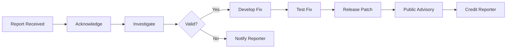

# 🔒 Security Policy

## AeternumDB Security Policy

<div align="center">

**Keeping AeternumDB secure for everyone**

Version 1.0 | Last Updated: 2026-04-25

</div>

---

## 📋 Table of Contents

- [Our Commitment](#-our-commitment)
- [Supported Versions](#-supported-versions)
- [Reporting a Vulnerability](#-reporting-a-vulnerability)
- [What to Include](#-what-to-include)
- [Response Process](#-response-process)
- [Scope](#-scope)
- [Responsible Disclosure](#-responsible-disclosure)
- [Security Best Practices](#-security-best-practices)
- [Hall of Fame](#-hall-of-fame)

---

## 🛡️ Our Commitment

The **AeternumDB team** takes security very seriously. Our goal is to ensure the database is:

- ✅ **Reliable** - Dependable and trustworthy
- ✅ **Secure** - Protected against threats and vulnerabilities
- ✅ **Safe** - Suitable for use in critical production environments

We are committed to working with security researchers and the community to:
- Identify and fix vulnerabilities promptly
- Maintain transparent security practices
- Protect our users and their data

---

## 📦 Supported Versions

Security updates are provided for the following versions:

| Version | Status | Support End Date |
|---------|--------|------------------|
| 0.1.x (current) | 🚧 **In Development** | Active |
| Future versions | ✅ **Planned** | TBD |

**Note:** As the project is in early development, we'll establish a formal versioning and security support policy before the 1.0 release.

---

## 🚨 Reporting a Vulnerability

### ⚠️ DO NOT Report Security Vulnerabilities Publicly

**Never:**
- ❌ Open a public GitHub issue
- ❌ Post in GitHub Discussions
- ❌ Share on social media
- ❌ Discuss in public forums

### ✅ Preferred Reporting Methods

#### Method 1: GitHub Security Advisory (Recommended)

1. Go to the [Security tab](https://github.com/schivei/aeternum-db/security)
2. Click "Report a vulnerability"
3. Fill out the form with details
4. Submit privately to maintainers

#### Method 2: Email (Alternative)

Send encrypted email to: **[security@aeternumdb.org]** (to be established)

**PGP Key:** [To be published]

---

## 📝 What to Include in Your Report

A good vulnerability report should include:

### Required Information

```markdown
### Vulnerability Report

**Title:** [Brief, descriptive title]

**Summary:**
[One-paragraph description of the vulnerability]

**Severity:** [Critical / High / Medium / Low]

**Component Affected:**
- [ ] Core Engine
- [ ] Extension System
- [ ] Network Protocol
- [ ] Storage Engine
- [ ] Authentication/Authorization
- [ ] Other: ___________

**Description:**
[Detailed explanation of the vulnerability]

**Steps to Reproduce:**
1. [First step]
2. [Second step]
3. [...]

**Proof of Concept:**
[Code, commands, or screenshots demonstrating the issue]

**Impact:**
[What could an attacker do? What data/systems are at risk?]

**Affected Versions:**
[Which versions are vulnerable?]

**Suggested Fix:** (optional)
[If you have ideas for how to fix it]

**References:**
[CVE IDs, similar vulnerabilities, related documentation]
```

### Additional Helpful Information

- Environment details (OS, Rust version, configuration)
- Logs or error messages
- Network captures (if applicable)
- Exploitability assessment

---

## ⏱️ Response Process

### Timeline and SLAs

| Stage | Timeline | Description |
|-------|----------|-------------|
| **Initial Response** | ≤ 48 hours | Acknowledge receipt of your report |
| **Triage** | ≤ 7 days | Assess severity and validity |
| **Status Update** | Weekly | Keep you informed of progress |
| **Fix Development** | Varies | Depends on complexity and severity |
| **Security Advisory** | Post-fix | Public disclosure coordinated with you |

### Our Process



### Severity Classification

| Level | Description | Response Time |
|-------|-------------|---------------|
| 🔴 **Critical** | RCE, data loss, authentication bypass | Immediate (24-48h) |
| 🟠 **High** | Privilege escalation, injection attacks | 7 days |
| 🟡 **Medium** | DoS, information disclosure | 30 days |
| 🟢 **Low** | Minor issues, edge cases | 90 days |

---

## 🎯 Scope

### In Scope

This security policy covers:

#### Core Components

- ✅ **Core Engine** (AGPLv3.0)
  - Transaction manager
  - Storage engine
  - Query parser and executor
  - Replication system

- ✅ **Network Protocols**
  - Binary protocol
  - gRPC implementation
  - Authentication mechanisms

- ✅ **Extension System** (MIT)
  - WASM runtime
  - Extension API/ABI
  - Sandboxing mechanisms

- ✅ **SDKs and Drivers** (Apache 2.0)
  - ODBC driver
  - JDBC driver
  - Official client libraries

- ✅ **Deployment Configurations**
  - Docker images
  - Kubernetes manifests
  - Container security

### Out of Scope

The following are generally not considered security vulnerabilities:

- ❌ Issues in third-party dependencies (report upstream)
- ❌ Social engineering attacks
- ❌ Physical access attacks
- ❌ DDoS without amplification
- ❌ Issues requiring unlikely user interaction
- ❌ Theoretical attacks without proof of concept

**Note:** If unsure, report it anyway. We'll help determine if it's in scope.

---

## 🤝 Responsible Disclosure

### Our Commitment to You

If you report a vulnerability responsibly, we commit to:

- ✅ Respond promptly and professionally
- ✅ Keep you updated on our progress
- ✅ Work with you to understand the issue
- ✅ Credit you in the security advisory (if desired)
- ✅ Not pursue legal action for good-faith research

### We Ask That You

- ✅ Give us reasonable time to fix the issue before disclosure
- ✅ Do not exploit the vulnerability beyond demonstration
- ✅ Do not access, modify, or delete user data
- ✅ Act in good faith toward our users and the project

### Disclosure Timeline

**Coordinated Disclosure:**
- We aim to fix vulnerabilities within 90 days
- Public disclosure happens after fix is available
- We'll coordinate timing with you
- If we can't fix in 90 days, we'll explain why

---

## 🔐 Security Best Practices

### For Users

#### When Deploying AeternumDB

```bash
# ✅ Use latest stable version
docker pull aeternumdb:latest

# ✅ Enable TLS/SSL
--enable-tls --cert-file=/path/to/cert.pem

# ✅ Use strong authentication
--auth-method=certificate

# ✅ Regular backups
--backup-interval=daily

# ✅ Monitor logs
--log-level=warn --audit-log=enabled
```

#### Network Security

- 🔒 Run behind a firewall
- 🔒 Use VPN for remote access
- 🔒 Implement network segmentation
- 🔒 Enable encryption in transit

#### Access Control

- 👤 Use principle of least privilege
- 👤 Rotate credentials regularly
- 👤 Enable multi-factor authentication (when available)
- 👤 Audit access logs

### For Contributors

#### Secure Coding Practices

```rust
// ✅ Good: Input validation
pub fn execute_query(sql: &str) -> Result<ResultSet, Error> {
    if sql.len() > MAX_QUERY_LENGTH {
        return Err(Error::QueryTooLong);
    }
    // Validate and sanitize input
    let validated = validate_sql(sql)?;
    // ... execute
}

// ❌ Bad: No validation
pub fn execute_query(sql: &str) -> ResultSet {
    // Direct execution without checks - SQL injection risk!
    unsafe_execute(sql)
}
```

#### Code Review Checklist

- [ ] Input validation and sanitization
- [ ] Output encoding
- [ ] Authentication and authorization checks
- [ ] Secure defaults (fail-safe)
- [ ] Error messages don't leak sensitive info
- [ ] Cryptography uses modern, secure algorithms
- [ ] No hardcoded secrets or credentials

---

## 🏆 Hall of Fame

We recognize and thank security researchers who help keep AeternumDB secure:

### 2026

*No vulnerabilities reported yet - be the first!*

### Recognition Levels

- 🥇 **Critical** - Major vulnerability, significant impact
- 🥈 **High** - Important vulnerability, moderate impact
- 🥉 **Medium** - Useful report, limited impact

**Want to be listed?** Let us know when reporting if you'd like credit!

---

## 📚 Additional Resources

### Security Documentation

- [OWASP Top 10](https://owasp.org/www-project-top-ten/)
- [CWE Top 25](https://cwe.mitre.org/top25/)
- [Rust Security Guidelines](https://anssi-fr.github.io/rust-guide/)

### Compliance

AeternumDB aims to support:
- 🇪🇺 GDPR (General Data Protection Regulation)
- 🇧🇷 LGPD (Lei Geral de Proteção de Dados)
- ⚖️ SOC 2 (future)
- ⚖️ ISO 27001 (future)

---

## 📞 Contact

### Security Team

- **Email:** [security@aeternumdb.org] (to be established)
- **PGP Key:** [To be published]
- **GitHub:** [@aeternumdb-security](https://github.com/aeternumdb-security)

### Emergency Contact

For critical vulnerabilities requiring immediate attention:
- Create a [Security Advisory](https://github.com/schivei/aeternum-db/security/advisories/new)
- Mark as "Critical" priority

---

## 📝 Policy Updates

This security policy may be updated periodically. Changes will be:
- Documented in git history
- Announced in release notes
- Posted in GitHub Discussions

**Last Updated:** 2026-04-25 | **Version:** 1.0

---

<div align="center">

**Thank you for helping keep AeternumDB secure!** 🛡️

[⬆ Back to top](#-security-policy)

</div>
